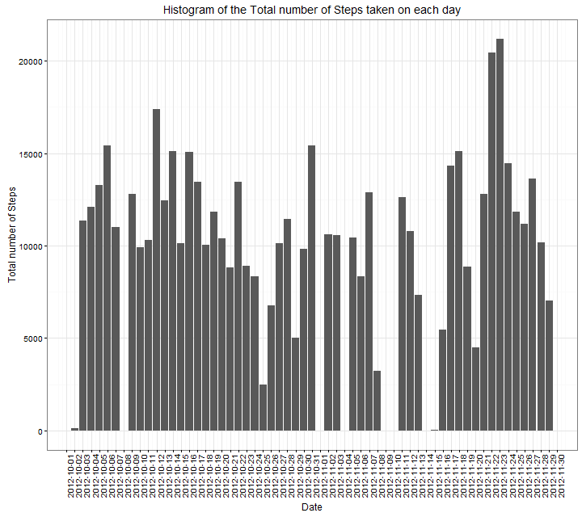
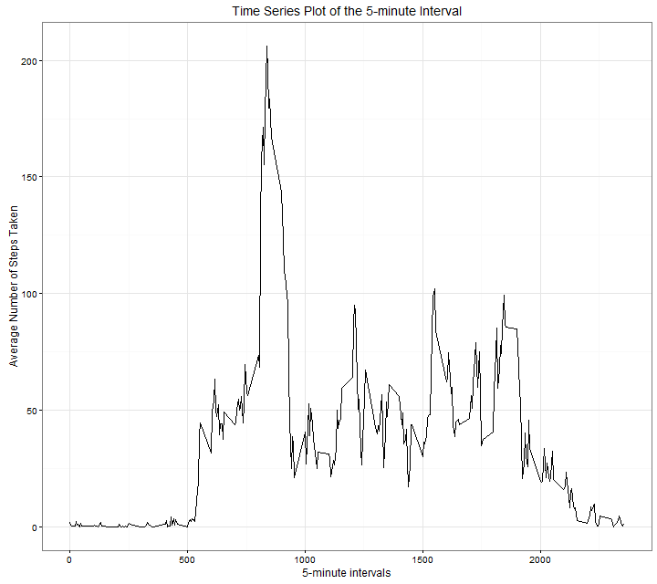
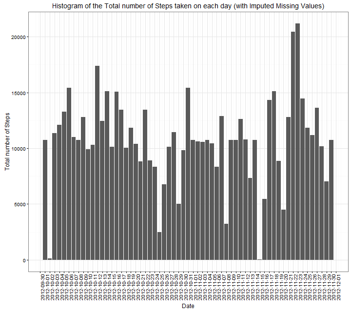
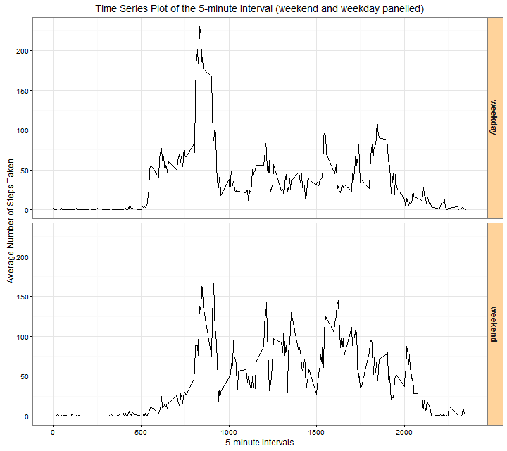

# Reproducible Research: Peer Assessment 1
Kitoogo Fredrick  
The overall goal of this assignment is to demonstrate the capability in 
Rerproducible Research and ultimately writing a report in a single
R markdown document that can be processed by knitr and be transformed into an HTML file

## Load Requisite Packages
```R
## ----- Loading requisite packages -----------
library("ggplot2", lib.loc="\\\\Rsv-nita-01/USER$/Fredrick.Kitoogo/R/win-library/3.2")
library("scales", lib.loc="C:/Program Files/R/R-3.2.4/library")
library("plyr", lib.loc="C:/Program Files/R/R-3.2.4/library")
library("dplyr", lib.loc="\\\\Rsv-nita-01/USER$/Fredrick.Kitoogo/R/win-library/3.2")
library("chron", lib.loc="\\\\Rsv-nita-01/USER$/Fredrick.Kitoogo/R/win-library/3.2")
```

## Loading and preprocessing the data

```R
# Loading and Processing the Data
## 1. Read the data into a data frame 
unzip(zipfile="repdata-data-activity.zip") ## first unzip the file
activity <- read.csv("activity.csv", header = TRUE)

## 2. Process and Transform the data frame into a format suitable for proper analysis
activity$date <- as.Date(activity$date) ## the date column to date
```

## What is mean total number of steps taken per day?

```R
## 1. Calculate the total number of steps taken per day and store the result into a 
## new data frame
activity_agg_per_Day <- aggregate(steps ~ date, data = activity, 
                           FUN = "sum", na.rm = TRUE)

## 2. Make a histogram of the total number of steps taken each day
### make the day bins and the limits so as to plot daily data
lower_Limit <- min(activity_agg_per_Day$date) - 1
upper_Limit <- max(activity_agg_per_Day$date) + 1
daybins <- seq.Date(lower_Limit, upper_Limit, by = "day")


### Make a histogram of the total number of steps taken each day
png(filename = "hist_Tot_Steps.png", width = 720, height = 640) ## open the plotting device

ggplot(data = activity_agg_per_Day, aes(x = date, y = steps)) + 
  geom_bar(stat = "identity") + 
  scale_x_date(labels = date_format("%Y-%m-%d"), 
               breaks = daybins) +
  ggtitle("Histogram of the Total number of Steps taken on each day") +
  labs(x = "Date", y="Total number of Steps") +
  theme_bw() + theme(axis.text.x = element_text(angle=90, vjust=1))
dev.off() ## close the plotting device
```

 

```R
## 3. Calculate and report the mean and median of the total number of steps taken per day
mean_steps <- mean(activity_agg_per_Day$steps, na.rm = TRUE) # Mean = 10766.19
median_steps <- median(activity_agg_per_Day$steps, na.rm = TRUE) # Median = 10765
```
* The Mean = 10766
* The Median = 10765

## What is the average daily activity pattern?

```R
## 1. Make a time series plot (i.e. type = "l") of the 5-minute interval (x-axis) 
## and the average number of steps taken, averaged across all days (y-axis)
activity_avg_per_Interval <- aggregate(steps ~ interval, data = activity, 
                                  FUN = "mean", na.rm = TRUE)

### Make a time series plot
png(filename = "ts_Avg_Steps.png", width = 720, height = 640) ## open the plotting device

ggplot(data = activity_avg_per_Interval, aes(x = interval, y = steps)) + 
  geom_line() + 
  ggtitle("Time Series Plot of the 5-minute Interval") +
  labs(x = "5-minute intervals", y="Average Number of Steps Taken") +
  theme_bw() 
dev.off() ## close the plotting device
```


```R
## 2. Which 5-minute interval, on average across all the days in the dataset, 
## contains the maximum number of steps?
max_Avg <- activity_avg_per_Interval[which.max(activity_avg_per_Interval$steps),]

```
Maximum Average Number of steps

*         Interval  steps
**  104      835 206.1698

## Imputing missing values

```R
## 1. Calculate and report the total number of missing values in the dataset 
## (i.e. the total number of rows with NAs)
missing_No <- sum(is.na(activity)) # missing_No = 2304

## 2. Devise a strategy for filling in all of the missing values in the dataset. 
## check to see which columns have missing values
colnames(activity)[apply(is.na(activity), 2, any)] ## only the "steps" column has missing values

## 3. Create a new dataset that is equal to the original dataset but with the missing data filled in.
new_activity <- activity %>%
  group_by(interval) %>% 
  mutate_each(funs(replace(., which(is.na(.)),
                             round(mean(., na.rm=TRUE)))))

## Check to establish that there are no missing values
sum(is.na(new_activity)) ## equates to 0

## 4. Make a histogram of the total number of steps taken each day and Calculate and report 
## the mean and median total number of steps taken per day. Do these values differ from the
## estimates from the first part of the assignment? What is the impact of imputing missing data 
## on the estimates of the total daily number of steps?

### Calculate the total number of steps taken per day (when missing data has been imputed
### and store the result into a  new data frame
new_activity_agg_per_Day <- aggregate(steps ~ date, data = new_activity, 
                                  FUN = "sum", na.rm = TRUE)

## Make a histogram of the total number of steps taken each day
### make the day bins and the limits so as to plot daily data
new_lower_Limit <- min(new_activity_agg_per_Day$date) - 1
new_upper_Limit <- max(new_activity_agg_per_Day$date) + 1
new_daybins <- seq.Date(new_lower_Limit, new_upper_Limit, by = "day")


### Make a histogram of the total number of steps taken each day
png(filename = "new_hist_Tot_Steps.png", width = 720, height = 640) ## open the plotting device

ggplot(data = new_activity_agg_per_Day, aes(x = date, y = steps)) + 
  geom_bar(stat = "identity") + 
  scale_x_date(labels = date_format("%Y-%m-%d"), 
               breaks = new_daybins) +
  ggtitle("Histogram of the Total number of Steps taken on each day (with Imputed Missing Values)") +
  labs(x = "Date", y="Total number of Steps") +
  theme_bw() + theme(axis.text.x = element_text(angle=90, vjust=1))
dev.off() ## close the plotting device
```


```R
## 3. Calculate and report the mean and median of the total number of steps taken per day
new_mean_steps <- mean(new_activity_agg_per_Day$steps, na.rm = TRUE) # Mean = 10765.64
new_median_steps <- median(new_activity_agg_per_Day$steps, na.rm = TRUE) # Median = 10762

## compute the impact on both the mean and medians before and after
impact_mean <- new_mean_steps - mean_steps ## -0.549335
impact_median <- new_median_steps - median_steps ## -3
```
* By imputing the missing values, the mean and median lower (decrease by 0.549335 and 3 respectively)


## Are there differences in activity patterns between weekdays and weekends?

```R
## 1. Create a new factor variable in the dataset with two levels - "weekday" and "weekend" 
## indicating whether a given date is a weekday or weekend day.
## use the chron package (function is.weekend) to isolate a weekday and weekend
new_activity <- transform(new_activity, 
            day_Type = ifelse(chron::is.weekend(new_activity$date),"weekend","weekday"))

## 2. Make a panel plot containing a time series plot (i.e. type = "l") 
## of the 5-minute interval (x-axis) and the average number of steps taken, 
## averaged across all weekday days or weekend days (y-axis). 

### make the averaged data frame using the transformed data frame
new_activity_avg_per_Interval <- aggregate(steps ~ interval + day_Type, data = new_activity, 
                                       FUN = "mean", na.rm = TRUE)

### Make a time series plot
png(filename = "new_ts_Avg_Steps.png", width = 720, height = 640) ## open the plotting device

## Set the graphical parameters to accomodate 2 plots in one window
par(mfrow = c(2,12), mar = c(4,4,2,1), oma = c(0,0,2,0))

ggplot(data = new_activity_avg_per_Interval, aes(x = interval, y = steps)) + 
  geom_line() + 
  facet_grid(day_Type ~ .) +
  ggtitle("Time Series Plot of the 5-minute Interval (weekend and weekday panelled)") +
  labs(x = "5-minute intervals", y="Average Number of Steps Taken") +
  theme_bw()+
  theme(strip.text.x = element_text(size=8, angle=75),
        strip.text.y = element_text(size=12, face="bold"),
        strip.background = element_rect(fill="burlywood1"))
dev.off() ## close the plotting device
```


* Yes, there are differences in activity patterns between weekdays and weekends


